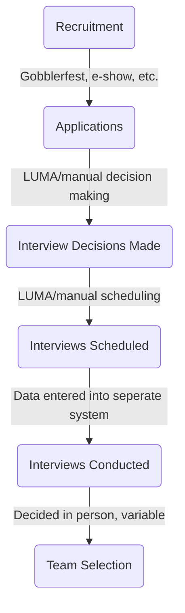
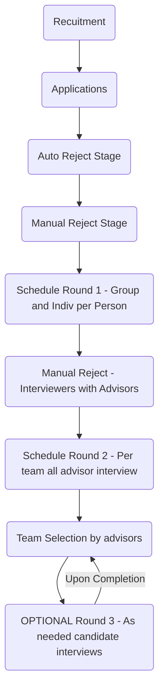

written as of 5/1/2026

## Background

Current process is incredibly bulky, difficult logistically, and a overall is a difficult problem overall. The concept is we need to take ~300 people, narrow down to ~30 in a setting where most applicants have little to no experience, little interview experience, and all sorts of other extenuating circumstances. This process has been handled in various ways, via manual scheduling, and manual group decision making.

### Tradition/Past Process

In Archimedes per tradition we do a two-round interview process, consisting of a individual round and group interview round. From a practical standpoint, this is truly a one-round interview process, as no candidates are cut between rounds. These historically are scheduled back to back, taking an hour total per person. This can be seen in the [Problem Description](https://docs.google.com/presentation/d/1b_yqwS6iFbZwV-NlKe9EPU5WzslbUM8bTDPFODjI-zI/edit?slide=id.g35fc2d51008_0_107#slide=id.g35fc2d51008_0_107) in slides 9-11 which show the other variations of this implementation.

Additionally, scheduling, interviewing, and selection have historically been treated as all separate processes in separate systems. [This](https://docs.google.com/presentation/d/168C-A1toQWJifZLA4KZPk58YGJ8OcjhHmZUkk9U_OAo/edit?slide=id.g3364a7cff91_0_1198#slide=id.g3364a7cff91_0_1198) is a sample of how selection has gone historically, and many variations of this occur. More or less a 'town hall' style discussion and selection occurs, and the advisors for each team end up having the final say in the selections for their own teams.

A look at the past process:

Each round of interviews has been handled with a google form...
[Individual](https://docs.google.com/spreadsheets/d/1wivy8RYLoolphb1rHBafbd-LPFvJ6SZNrtcXg_TdCKE/edit?gid=54018691#gid=54018691)
[Group](https://docs.google.com/spreadsheets/d/1w0GKi_wZU-I4UHktjgVK9ElEwDpjpiH3O7e1po-Dv-Q/edit?gid=2128725126#gid=2128725126)

[Schedule](https://virginiatech-my.sharepoint.com/:x:/g/personal/ostuckman_vt_edu/EVgZ_1vnyZBPkLgS54kq_10BW92fl-crvGHQOFxgtG_rXA?e=ekOUC0)

This form was then used for team selection as the source of information.

## The Problems

Currently there are some relatively evident problems with the current process. Here is a short list:

- We schedule over 400 interviews for a total of <30 open positions
- ~90-95% of applicants pass the initial screen
- Of those who pass the initial screen, all of them get interviewed. In other words, ~250 people interview for more or less the same positions, of which we have <30.
- A major consideration is effort/work ethic. This is entirely up to each interviewers discretion of what is good work ethic.
- Often times the interviewers are not of the same team or even have any idea what work the interviewee will be doing. Also often time do not have a background to understand anything from a technical standpoint.
- Interviewers have minimal experience in interviewing, which leads to large variance in interviews.
- Team advisors often do not interact with candidates until they are inducted into Archimedes.
- My biggest personal gripe is how **_inefficient nearly every stage of the process is_**. Scheduling has been somewhat automated, but every stage onward is entirely manual, and there is no consistencies person to person at all.

Of course, there are many more, but these are just the most immediate things that stand out.

The problem though is that many of these are just symptoms of systematic failures at each step. Each step is far too vague and ambiguities tend to slip further down the chain. For example a candidate that passes into the interview stage that should not be there 'muds' up the interviews, and bogs down the whole system. This requires more capacity, which has historically been solved with more interviewers, which creates then more inconsistencies as more interviewers are introduced, and inconsistent scoring. Then this causes a larger review process for Team Selection.

The issue described above occurs in each stage, and hence needs to be extremely minimized. These cause the process to:

- Be slow
- Pick worse candidates
- Increase randomness

## Proposed Solutions

I am essentially proposing an entire rehaul to the whole process. There are some other ideas I will explore below which are not entire rehauls, but I truly believe the best solution will be one which drastically changes our current process. There is just way too much inconsistencies that continue to fail at scale.

From a numbers standpoint, here is where we are right now (approximately):

450 Show interest
250 Apply
200 Interview
30 Selected

My primary issue with the process is that we go from 200 to 30 people in one step (85% decrease). ~45% decrease from interest to application which is fine, and a ~20% decrease with these numbers. The step from interview to selection should be significantly tighter.

Here is the new process:

To describe more in depth by step:

##### Recruitment:

- Stays the same, I think we have done phenomenally here and will only improve.

##### Applications:

- Fine as is, is just a form. Perhaps questions need to be worder more strictly, but will talk about in next step.

##### Auto Reject Stage:

- Applications need to now be rejected based off of set questions, which is something that was done manually last year, but I believe a few more need to be added.
- Ex: Apply for Infinitum, not 18+ --> Reject
- I believe a minimum experience requirement should be added, alongside some basic responsibility questions. Can you commit 5-10 hours a week? Have you worked on a interdisciplinary team or design team before? Etc.

##### Manual Reject:

- Stricter rubric, fine to accept a fairly large number. Primary rejection quality is lack of effort/excitement which is clear to several people. Same process of need 3 approves to get through is a good concept.

##### Round 1:

- Same as historic my changes are to cut down the total number of interviewers significantly. Interviewers should be doing a larger number of interviews, and will have a larger trainings session for this, rather than just anyone doing them or popping in to do one or two.
- Importance here is getting as much data as possible on them not included in their application, particularly in ability to communicate. Needs to be reworked to focus on getting practical info out, rather than random comments.

##### Manual Reject:

- New, advisors sit with the interviewers and determine which ones will pass to the next round. This is where interviewers/advisors can determine truly what they are looking for and cut out candidates which do not fit.
- The main change is here is where they are picked on a per team basis, each team decides to interview them or not. So a candidate could then have multiple round 2 interviews depending on the scenario. Each process will run unique, and if a double up occurs, teams will discuss which one would be a better fit.

##### Round 2:

- Each candidate interviews with ALL of the advisors. This is intentional, to minimize the number of people who they interview.

##### Team Selection:

- Done by own advisors in the format they decide upon.

##### Round 3:

- As needed for things where perhaps candidates got picked for two teams or other edge cases.

#### Main changes:

- Becomes a per team process after round 1
- Addition of a round
- Auto reject of candidates at the application stage
- each interview is treated on a per team basis

---

#### Additional Changes/Ideas:

All of these are not integral, but would be improvements and can be opted to do or not:

- Weighted average scoring for round 1. Essentially to remove bias from particular interviewers scoring everyone high, or low in comparison to everyone else
- Larger process for initial screen. Add in a video/project artifact requirement to cut down submissions/low quality submissions.
- Blinded review in the initial screen, so reviewers do not know who they are reviewing. Pretty minor, but has allowed some people through perhaps just off of people knowing them or recognizing the name.
- avoid scheduling advisors in initial first round, to remove any potential bias in later selection and since they will be doing interviews in r2 and r3
- Unique question per team -> custom questions for each team

- make round 2 optional and just determined by each unique team

- edge case of candidate being selected for both teams considered

- gonna just do what this is more or less, let each team determine the process

- have an eboard person work with each set of advisors
- intermediate idea is to just do some callbacks

- add more time in-between interviews

- if was previously on a team, ie on infinitum, preference is for them to interview for infinitum. if they are an advisor, preference is for them to not be interviewing in round 1
- i want the capacity to schedule all interviews for one team on a per team basis

## Current Build

LUMA works to auto schedule all interviews, record notes of interviews, create roles, and do all the traditional work of an ATS (Applicant Tracking System).
